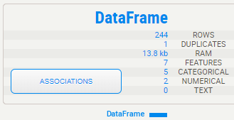
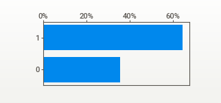
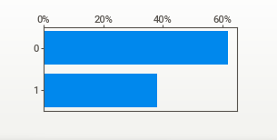
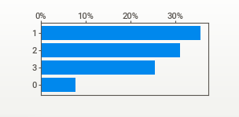
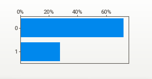
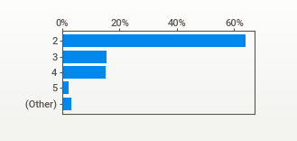
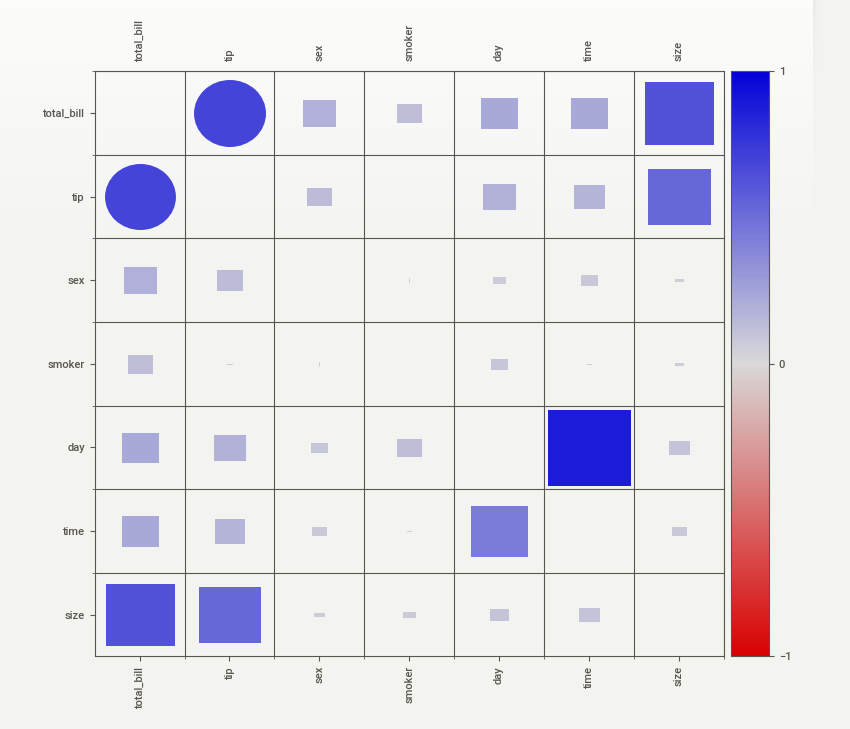

# ML Algorithm for Tips Prediction
This is a simple machine learning algorithm that incorporates the use of very general models in the prediction of the amount of money left over as a tip. The data was obtained from kaggle at [Kaggle Data](https://www.kaggle.com/code/rupakroy/waiter-tips-prediction/data)

## Descriptive Statistics
Descriptive statistics were performed on the dataset to provide the basic information about the individual variables and to initially identify the potential relationships between the variables. The image below shows the description of the data. 

<h5 align="left"> Data Description </h5>
The table below shows the measures of central tendency of the numerical columns in the dataset.

#### Measures of Central Tendencies
| Columns/Stats | Mean | Median | Standard Dev. | Max value | Min value
|:---|:---|:---:|:---|:---|:---:|
| total_bill | 19.80 | 17.80 | 8.90 | 50.80 | 3.10
| tip | 3.00 | 2.90 | 1.38 | 10.00 | 1.00

After the cleaning and coding of the categorical and other data, the data summaries came down to:
* sex\
The sex demographic of the one who made the tip

<h5 align="center"> where 0 = female and 1 = male </h5>

* smoker\
Whether the tipper was a smoker or a non-smoker

<h5 align="left"> where 0 = No and 1 = Yes </h5>

* day\
The day of the week

<h5 align="left"> where 0 = Thur, 1 = Fri, 2 = Sat and 3 = Sun </h5>

* time\
The time of the day

<h5 align="left"> where 0 = Dinner and 1 = Lunch </h5>

* size\
The family size

## Table of Association
Shown below is the table of association between the variables. The python package `sweetviz` is used to generate this grid of associations. 

